# Object Detection model training report

## Model Improvements
A new version of config file is created named `pipeline_new.config` and is placed inside the folder `experiments/reference/`. There are few modifications to the config file to improve the model performance. Some of them are:

1.  **Data Augmentation**:
    
    Defintion:  Data augmentation is a technique used to increase the diversity and size of a training dataset by applying various transformations to the existing data.

    Different augmentations that are used in this model config are:

    -   `random_horizontal_flip`:
     
    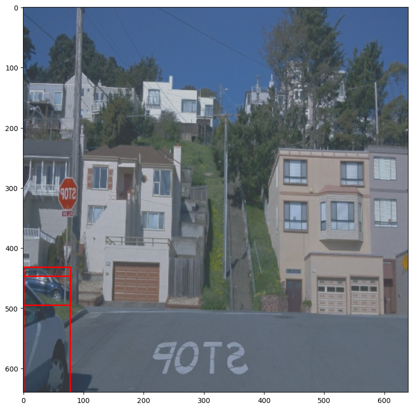
    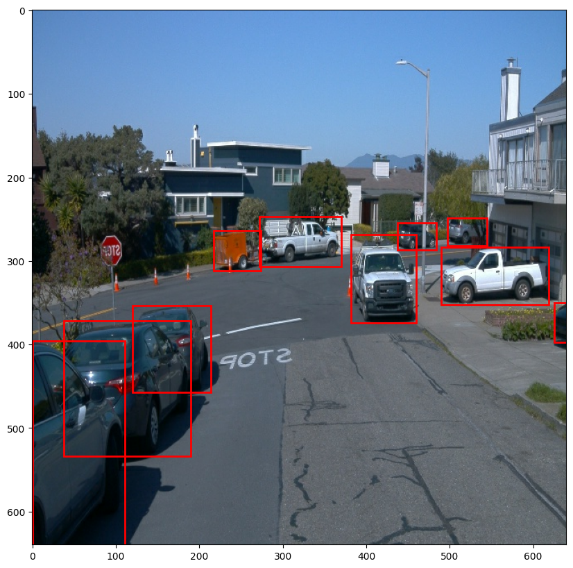
     
    In object detection and classification task, objects may appears in various orientations.
    The random horizontal flip technique is used to randomly flip an image horizontally during training. By randomly flipping the images horizontally, we expose the model to more variations of the same data. This helps the model generalize better by learning to recognize objects in different orientatios.

     

    -   `random_adjust_brightness`:
     
    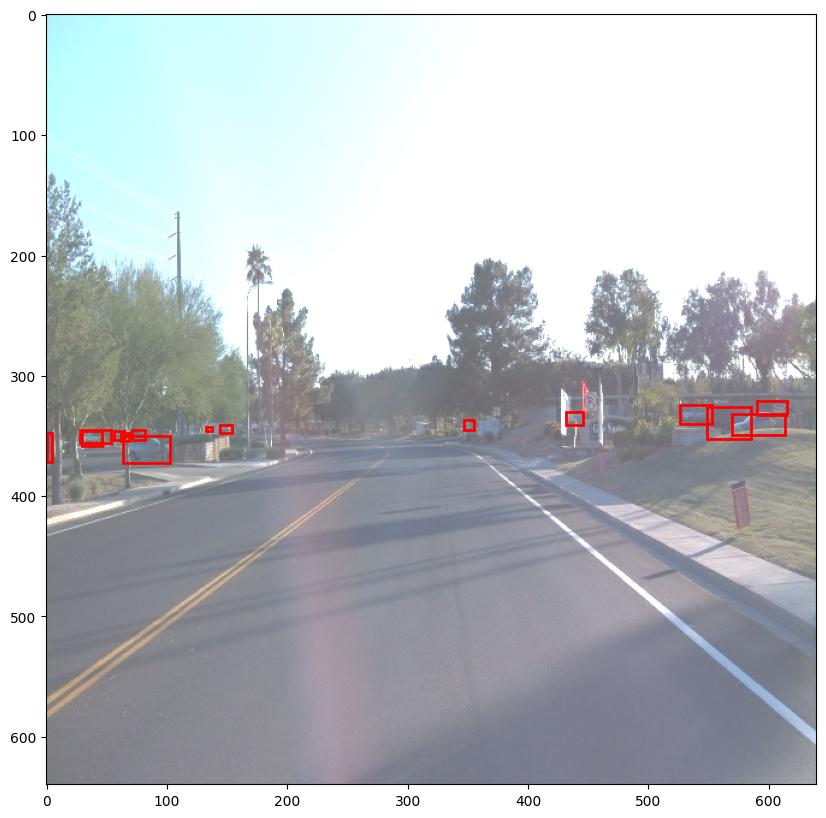
    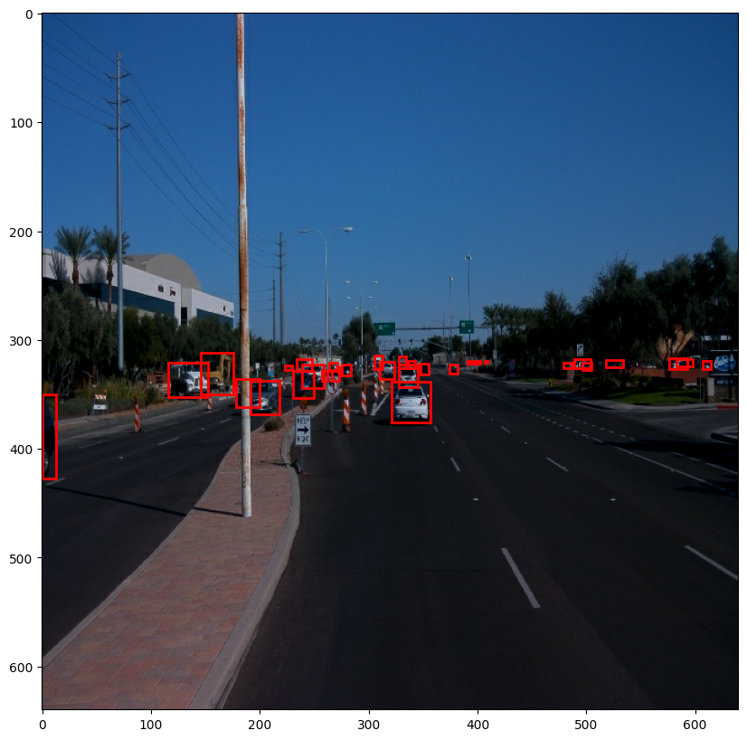
     
    This augmentation randomly increases or decreases the brightness of an image by adding a random scalar to the pixel values. Varying the brightness helps the model become invariant to lighting conditions. Particularly useful for outdoor images, where the brightness can change due to time of day, weather, or shadows.

     

    - `random_crop`:
     
    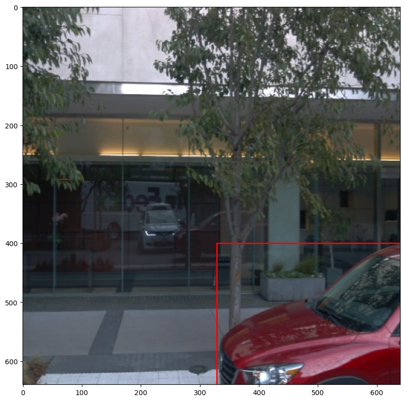
    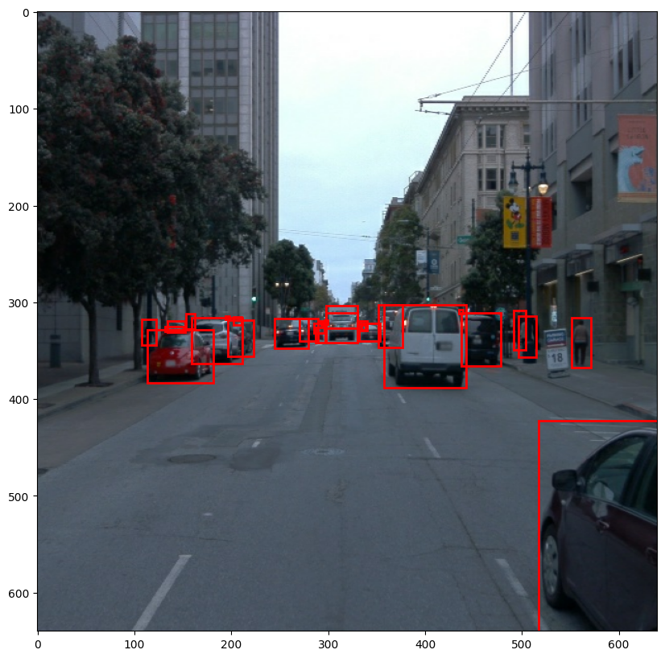
     
    Random cropping removed a random portion of the image and resizes it back to the original size. This forces the model to focus on different parts of the image and not just on the center. this improves the robustness of the model in real-world scenarios where objects can be partially cropped or positioned irregularly.

     

    -   `random_adjust_contrast`:
     
    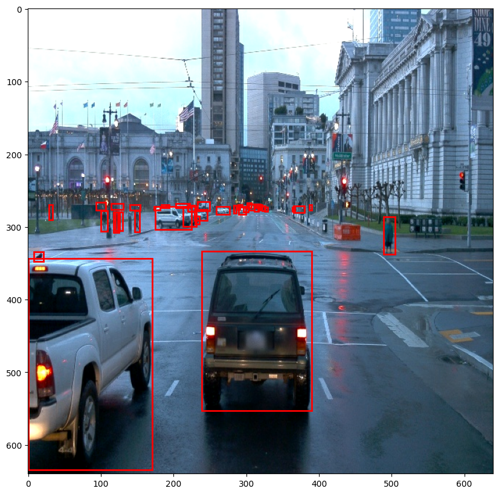
    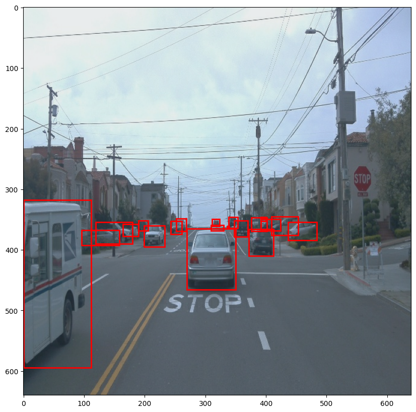
     
    This technique adjusts the contrast of an image by scaling the difference between each pixel value and the mean pixel value. Adjusting contrast helps the model be less sensitive to variations in lighting and color distribution in the image. It helps the model focus on the shape and structure of objects rather than their color intensity.

     

    -   `random_distort_color`:
     
    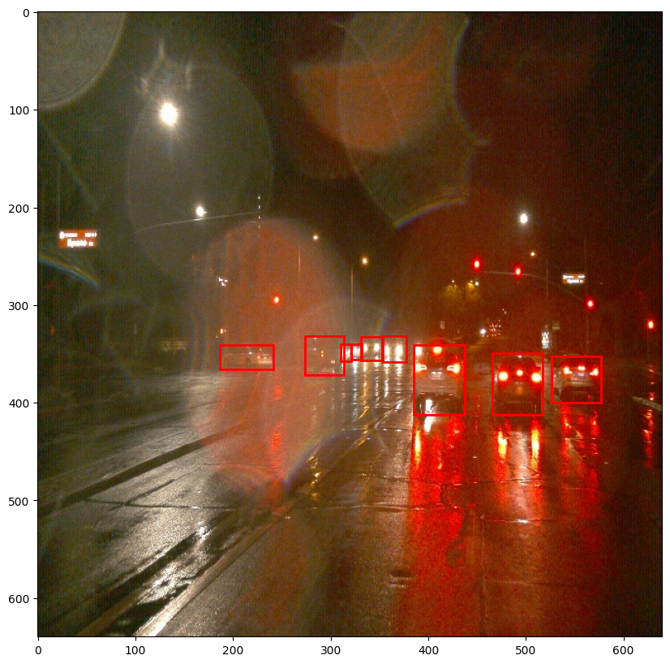
    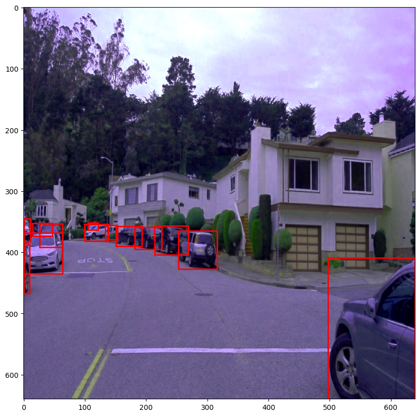
     
    This augmentation applies multiple color transformations to an image. Distorting the color helps the model become invariant to color shifts, making it more robust to variants in lighting, camera settings, or other color-related differences in the dataset.

     

    -   `random_adjust_hue`:
     
    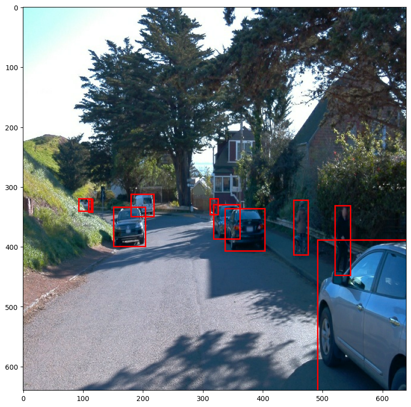
    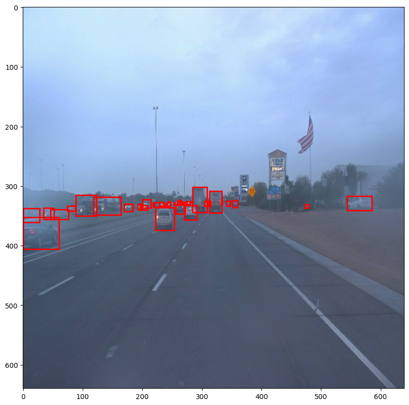
     
    Adjusts the hue of an image by rotating the color wheel. Randomly adjusting the hue allows the model to handle shifts in color, especially in cases where objects might appear in slightly different shades due to lighting, environment, or camera settings.

     

2. **Optimizer**:
    **Momentum Optimizer**:
    *   In this project, the training is done by using the **Momentum Optimizer**. This optimizer is used to accelerate the convergence of the gradient descent by adding a fraction of the previous update's direction to the current one. This helps overcome oscillations and speeds up learning, especially in scenarios with steep gradients.
    
    *   For further information about the optimizer click [here](https://github.com/tensorflow/models/blob/master/research/object_detection/protos/optimizer.proto)
    
3. **Learning Rate Configuration**:
    *   **Cosine Decay Learning Rate**:
         
        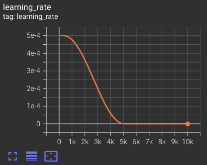

        For training, we used **Cosine Decay Learning Rate**. This gradually reduces the learning rate over time, following a cosine helps the model settle into a better local minimum by reducing oscillations in later stages of training.
    
    *   For further information about the learning rate click [here](https://github.com/tensorflow/models/blob/master/research/object_detection/protos/optimizer.proto)

 

## Training

The model that we used for training is **Single Shot Detector**(SSD) architecture with a **ResNet-50** backbone. This model takes input image of shape **640 x 640**. The model ran for `10000` timesteps.

*   **Losses**:

    Following are the plot for different loss functions during training

    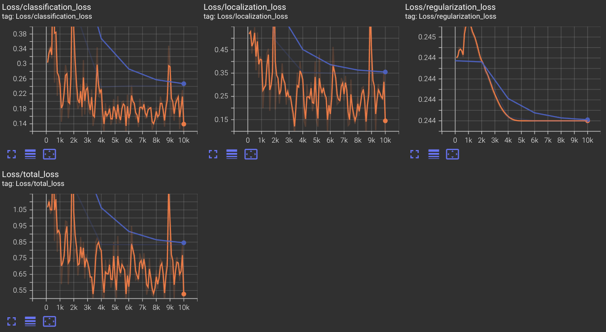

    1.  **Classification loss**:
        -   The training loss (orange line) exhibits considerable fluctuation but follows a general downward trend, indication the model is improving in terms of classiciation accuracy.
        
        -   The validation loss (blue line) is smoother and decreases steadily over time, showing that the model is generalizing better on unseen data, which is expected as training progresses.
    
    2.  **Localization loss**:
        -   Similar to the classification loss, the localization training loss (orange line) fluctuates significantly, but the validation los (blue line) shows a consistent decreasing trend.

        -   The localization loss measures how well the model predicts the bounding boxes or positions of objects.

        -   Fluctuations in training localization loss may indicate challenges with certain objects that are hard to detect.
    
    3.  **Regularization loss**:
        -   The regularization loss appears very stable for both the training and validation losses.

        -   The small, consistent difference between training and validation suggests that the regularization is working as intended without causing instability.
    
    4.  **Total loss**:
        -   The total loss combines the classification, localization and regularization losses. the training (orange line) total loss exhibits substantial variation, while the valication (blue line)loss follows a smoother and decreasing trend.

        -   The total loss shows us that while training fluctuations exist, the overall trend is a steady decrease, meaning that the model is gradually improving on both the training and validation sets.

 

*   **Precision**:
    Following are the plot for precision curve

    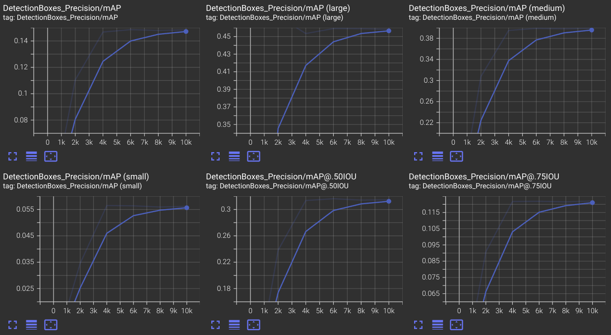

 

*   **Recall**:
    Following are the plot for precision curve

    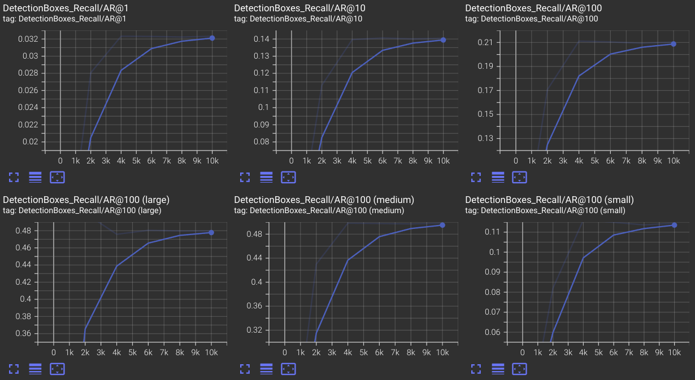

## Inference

 

 

 
