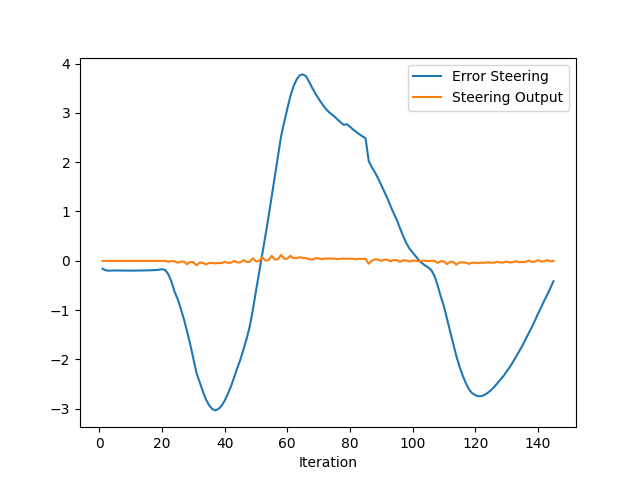

# Control and Trajectory Tracking for Autonomous Vehicles

<p align="left">An Ego vehicle moving forward by avoiding other vehicles in road.


## PID controller for Self-Driving Car
This project involves implementing a Proportional-Integral-Derivative (PID) controller to manage the throttle and steering of a self-driving car. The controller is designed to optimize the car's movement by minimizing the error between the desired and actual trajectory.

### 1. Throttle Control:
*   The PID controller adjusts the throttle to maintain a desired speed, balancing between acceleration and deceleration to avoid overshooting or oscillations.

*   **Hyper-Parameters**:
    -   `k_p`: 0.05
    -   `k_i`: 0.01
    -   `k_d`: 0.2
    -   `max_lim`: 1.0
    -   `min_lim`: -1.0

### 2. Steering control:
*   The steering angle is managed using another PID controller, ensuring the vehicle follows a target path by adjusting based on the cross-track error (CTE).

*   **Hyper-Parameters**:
    -   `k_p`: 0.015
    -   `k_i`: 0.0001
    -   `k_d`: 0.2
    -   `max_lim`: 1.2
    -   `min_lim`: -1.2


## Tuning the PID parameters:
*   The propotional term (`P`) reponds to the present error.
*   The integral term (`I`) accounts for past cumulative errors.
*   The derivative term (`D`) anticipates future error trends by considering the rate of change.


## How to run the scripts:
`Note`: Assuming that the workspace setup is already done by following the instructions mentioned [here](https://github.com/udacity/nd013-c6-control-starter)

*   **File Updates**: Replace the existing `main.cpp`, `pid_controller.h` and `pid_controller.cpp` file inside the `/project/pid_controller/` with the files in this folder respectively.
*   **Build the program**: Then build the project by running the following command
```bash
    cd project/pid_controller
    cmake .
    make
```
*   **Run the carla-simulator**: To run the carla-simulator run the following command on terminal
```bash
    /opt/carla-simulator/CarlaUE4.sh
```
*   **Run the program**: Run the controller program by running the following shell script
``` bash
    cd ..
    ./run_main_pid.sh
```

## Files:
*   `main.cpp`: This file contains the main function and the object for both the pid controllers (throttle controller and steer controller). This file takes care of generating trajectories, updating errors and sending the control command from the controller output.

* `pid_controller.h`: This header file contains the declaration of the pid controller class and its member variables

* `pid_controller.cpp`: This file contains all the definitions for the controller member functions. The member variables are initialized in the constructor and then these member variables are later updated depends on the errors.

## Q&A:

1. **Add the plots to yout report and explain them (describe what you see)**
    <br>
        
        
    <br>

    * The left image is the plot for steering error over the time period. We can see that the ego vehicle tries to minimize the cross track error. The PID controller appears to be doing a reasonable job of managing the steering, as the output remains fairly stable despite large fluctuations in the error.

    * The right image shows that the throttle output remains fairly smooth and stable, hovering close to zero throughout the iterations. There is a small degree of fluctuation in the throttle output, but it remains well-controlled compared to the large oscillations in the error.

2.  **What is the effect of the PID according to the plots, how each part of the PID affects the control command?**

    Based on the plots for steering and throttle control, we can infer the influence of each component of the PID controller (Proportional(`P`), Integral(`I`), and Derivative(`D`)) on the control commands and how they affect the system’s response.

    *   Proportional Term (`P`):
        -   This term adjusts the control output directly in proportion to the error. If the error increases, the proportional response becomes stronger.
        -   From the plots, in both the steering and throttle, we see large oscillations in the error values. This could indicate that the P term is dominating and responding too aggressively to the error, leading to overshooting.
        -   While the proportinal term is attempting to reduce the error quickly, its high value may be causing excessive corrections, leading to instability.

    *   Integral Term (`I`):
        -   The integral term sums up past errors, which helps eliminate residual steady-state errors that the proportional term alone cannot address. It applies a correction proportional to the accumulated error over time.
        -   From the plots, the throttle output and steering output both stabilize around the zero line over time, suggesting that this term is slowly reducing any consistent, steady-state errors that might persist after the proportional correction.
        -   If the integral gain is too strong, it could results in oscillations or cause overshooting due to accumulated errors over time.

    *   Derivative Term (`D`):
        -   The derivative term predicts future error by looking at the rate of change of the error(i.e., how fast the error is growing or shrinking). It helps in damping oscialltions and stabilizing the response by counteracting sudden changes in the error.
        -   From the plots, the steering and the throttle errors, we can observe the oscillations, especially around the peaks. 
        -   The steering output remains relatively smooth despite the fluctuations in error, which indicates that the derivative term might be providing some level of damping, preventing larger oscillations from directly affecting the output.

3.  **How would you design a way to automatically tune the PID parameters?**

    *   Designing an automatic PID tuning system requires a structured approach that dynamically adjusts the Proportional (`P`), Integral (`I`), and Derivative (`D`) parameters based on the system's performance. Before setting up the auto tuner, we need to define the performance metrics against which the performance of the system should be evaluated. Some of the performance metrics include:
        -   Rise-time
        -   Overshoot
        -   Steady-state error
        -   Settling time
        -   Control effort
    
    *   Tuning Methods: Below are the some of the tuning methods
        -   Particle Swarm Optimization (PSO)
        -   Generative Algorithm (GA)
        -   Ziegler-Nichols Tuning method
        -   Model-based ethods
    
    * Steps involved in the auto-tuning process:
        -   Initialize PID gains
        -   Apply tuning method
        -   Measure system response
        -   Calculate performance score
        -   Adjust PID parameters
        -   Convergence check
        -   Finalize PID gains

4.  **PID controller is a model free controller, i.e. it does not use a model of the car. Could you explain the pros and cons of this type of controller?**

    As PID controller is a model-free controller, meaning it does not require an explicit mathematical model of the system it is controlling. Instead, it uses feedback from the system (the error between the setpoint and the actual value) to compute the control action.

    *   **Pros**:
        -   No model needed: The PID controller doesn't require a detailed mathematical model of the system, making it easy to implement and deploy across wide range of systems.
        -   Starightforward tuning: PID controllers have only three parameters to tune, they are `Kp`, `Ki` and `Kd`, which can be adjusted based on system behavior without needing in-depth system knowledge.
        -   Real-time adaption: Since the PID controller is based on real-time feedback, it continuously adjusts the control signal to compensate for changes in system behavior or external disturbances.

    *   **Cons**:
        -   No anticipation of future behavior: A PID controller can only reacts to current and past errors, but has no capability to predict future behavior. This can lead to suboptimal performance, especially in systems where there are time delays, significant disturbances, or non-linear behaviors.
        -   Difficult to tune complex systems: While PID controller has only three parameters to tune, finding the correct balance between them for a system with complex dynamics can be very challenging.
        -   Susceptible to Noise and Disturbances: The derivative term in the PID controller is particularly sensitive to noise. In real-world systems like self-driving cars, sensor noise or external disturbances can cause the dervative term to amplify the noise,m resuting in jittery or erratic control commands.

5.  **What would you do to improve the PID controller?**
    Improving the performance of a PID controller, especially for complex systems like self-driving cars, can be done by addressing some of the inherent limitations while leveragoing its simplicity. Below are several strategies that could enhance the performance of the PID controller:
    -   Adaptive PID tuning
    -   Integrate Feedback control
    -   Noise-Filtering
    -   Usage of Model-Reference Hybrid approach
    -   Optimizing gains using Machine Learning algorithms
    -   Cascade control


