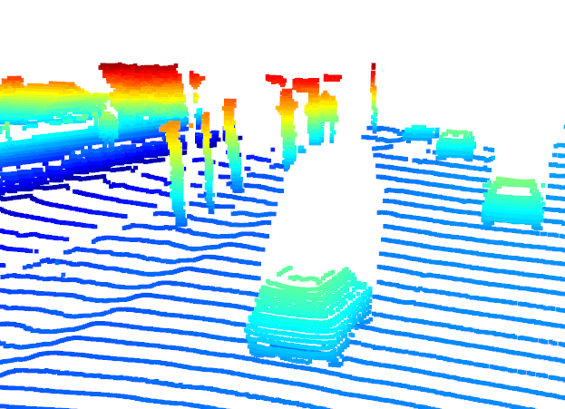
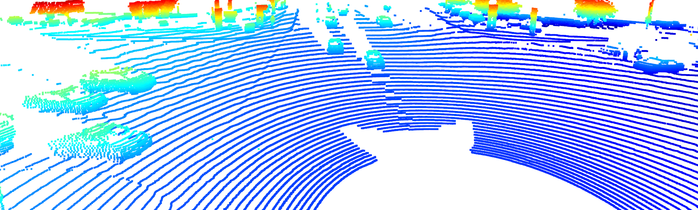
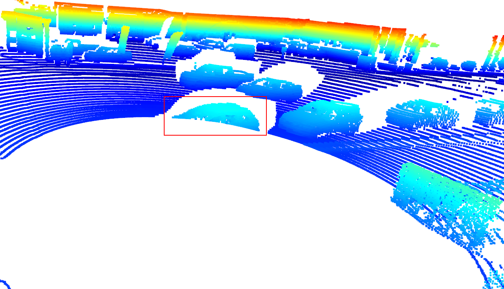
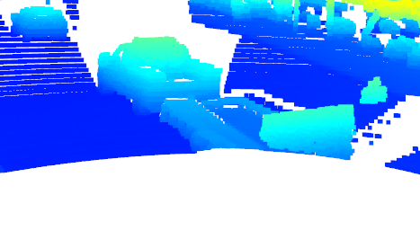
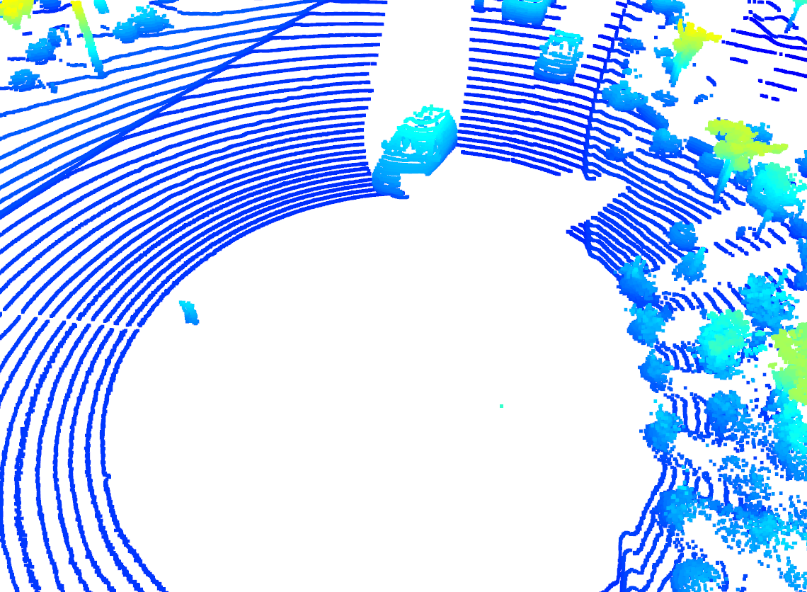
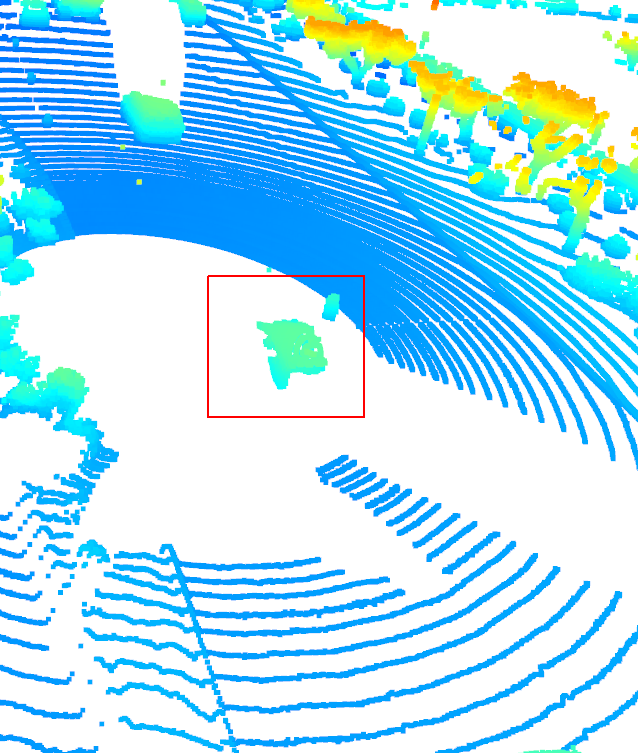
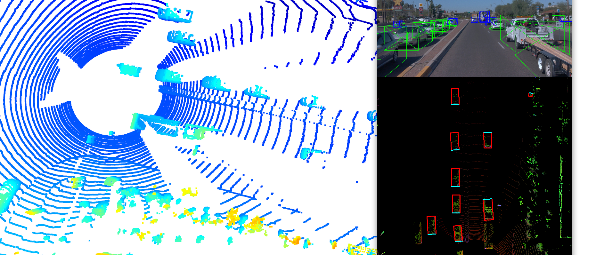
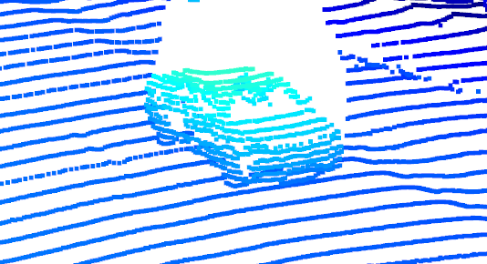
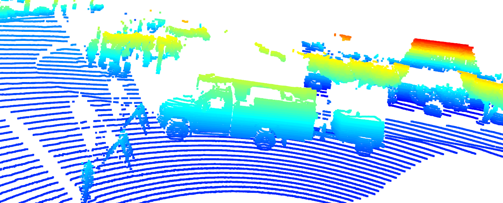
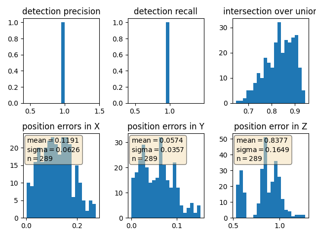

# Sensor Fusion
## Object Detection in BEV image

Range image sequence. Range channel (top), Intensity channel (bottom)

 
 

 Object detection on BEV image (bottom)
 

-------------------------------------------------------------------------------------

## Visualizing the **`pcd`** (point-cloud)
After visualizing the point-cloud on open3d module, following are the few findings.

### Visibility:

* #### Front-View
    <em><b>Fig.1</b></em> illustrates that the vehicles ahead of the ego vehicle are clearly discernible."

  
   
  <em><b>Fig.1:</b> Front-view of ego vehicle</em>

* #### Rear-View
<em><b>Fig.2</b></em> reveals that the vehicles trailing the ego vehicle are distinctly visible.

  
   
  <em><b>Fig.2:</b> Rear-view of ego vehicle</em>

* #### Corner cases
    - #### Blind spots
    <em><b>Fig.3</b></em> illustrates that certain areas in close proximity to the ego vehicle are not detected by the LiDAR. This occurs because parts of the ego vehicle, such as the body or roof, obstruct the LiDAR beams, creating shadowed regions where detection is impaired. These blind spots are particularly concerning as they increase the risk of potential collisions.
    

     
     
      
     
     
      
     <em><b>Fig.3:</b> Blind spots</em>
    
    

    - #### Omission of Attached Trailer
    <em><b>Fig.4</b></em> shows us that the detection module failed to detect the car trailer
    

     
      
     <em><b>Fig.4:</b> LiDAR misses car trailer detection</em>
    

 

### Stable Features of vehicle:
From <em><b>Fig.5</b></em> Here are some of the stable features observable in the vehicle's point cloud
* Side mirrors
* Front and Rear Bumper
* Wheels
* Head lights and Tail-lights
* Roofline/Roof Ridges
    

      
     
     
      
     <em><b>Fig.5:</b> Stable features of vehicle </em>
    

 

# Precision Recall Plot
