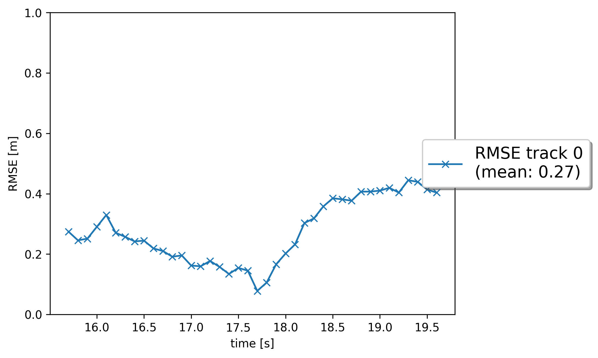
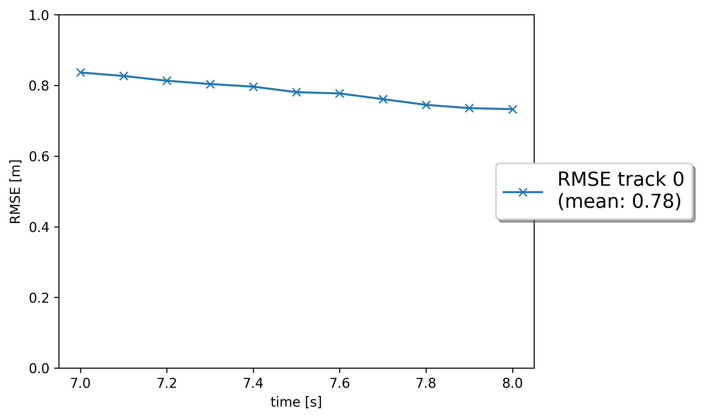
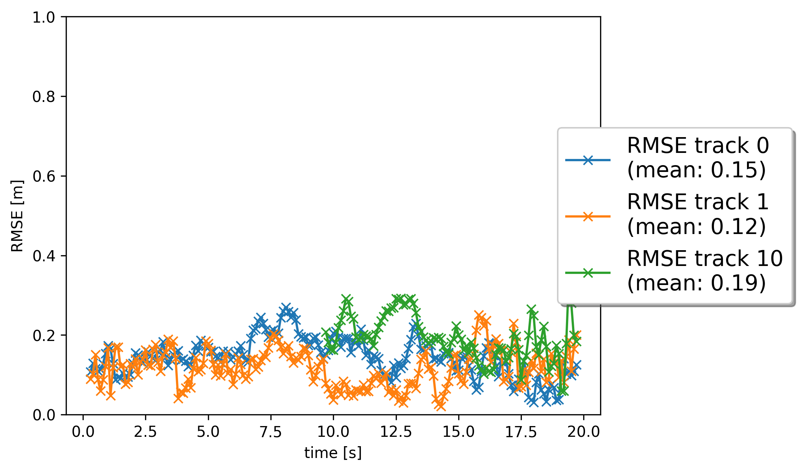
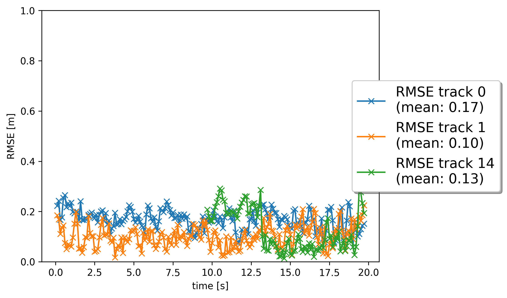

# Writeup: Track 3D-Objects Over Time

Multi-vehicle tracking

### 1. Write a short recap of the four tracking steps and what you implemented there (filter, track management, association, camera fusion). Which results did you achieve? Which part of the project was most difficult for you to complete, and why?

Four tracking steps:
*   `Extended Kalman Filter`:
    -   The EKF is an extended version of Kalman filter that is used to estimate the state of a moving object by fusing multiple sensor measurements over time. It accounts for the non-linear nature of the system and measurement models.
    -   Implemented the EKF to predit the next state using motion model of the objects and then update these predictions with the sensor measurements. This involves the prediction and update steps, where the linearization of the model takes place.
*   `Track management`:
    -   This involves creating, updating and deleting tracks to manage the lifecycle of detected objects in the scene.
    -   Initialize a track when a new measurement comes, update existing tracks with the new measurements and delete the tracks when objects are no longer visible or the track is considered unreliable.
*   `Association`:
    -   Data association links the sensor measurements to existing tracks, determining which measurements corresponding to which object.
    -   For association we have used Mahalanobis distance which calculates the association matrix of size NxM, where N is number of tracks and M is number of measurements.
*   `Camera Fusion`: 
    -   Camera sensor data is fused with lidar data for better next state prediction.
    -   First the camera data is transformed from vehicle coordinate to the camera image coordinate using Jacobian matrix. When camera data is fused with lidar data, the accuracy has increased visibly.

The results shows that the lidar-camera fused tracking performed better than the standalone tracking from lidar measurement.
I have not faced any major difficulty throughout the project

    
     
    <em><b>Fig.1:</b> The RMSE for lidar only tracking.</em>

 

    
     
    <em><b>Fig.2:</b>The RMSE for the lidar and camera fused tracking.</em>

 
<em><b>Fig(3)</b></em> and <em><b>Fig(4)</b></em> shows the plot for the step_1 and step_2 of this project.

### 2. Do you see any benefits in camera-lidar fusion compared to lidar-only tracking (in theory and in your concrete results)? 

    
     
    <em><b>Fig.3:</b> The RMSE for lidar only tracking.</em>

 

    
     
    <em><b>Fig.4:</b>The RMSE for the lidar and camera fused tracking.</em>

 
From <em><b>Fig(3)</b></em> and <em><b>Fig(4)</b></em> we can see that the lidar-camera fused tracking performed a little better than the standalone tracking from the lidar measurement. It shows that every sensor is having their own merits and demerits, so it is always prefered to use multi-sensor data for better performance and accuracy.

### 3. Which challenges will a sensor fusion system face in real-life scenarios? Did you see any of these challenges in the project?
Some of the challenges that usually occurs in different sensors.
* Sensor Noise and Uncertainty
* Sensor Misalignment and Calibration
* Data Association Problems
* Occlusions and Partial Observations
* Varying Sensor Modalities
* Environmental Conditions
* Dynamic and Complex Environments

Some of the issues that I faced during the project from above are:
* `Data Association Problems`: In dense environment the data association with just less distance is not working as expected.
* `Occlusions and Partial Observations`: Some of the vehicles in the scene are not tracked properly as they are occluded by other vehicles frequently. Due to this, the tracking is getting affected for those occluded vehicles.

### 4. Can you think of ways to improve your tracking results in the future?
The tracking can be improved by
* `Use of Nonlinear Filters`: 
    Implementing more sophisticated filtering techniques like the Unscented Kalman Filter (UKF) or Particle Filters can provide better tracking performance in highly nonlinear environments.
* `Enhanced Data Association`: 
    <b>Multi-Hypothesis Tracking (MHT)</b>, an improved data association technique which considers multiple potential tracks and selecting the most likely one based on future observations.
* `Model-free Approach`:
    Model-free methods do not rely on predefined motion models (e.g., constant velocity or acceleration), making them adaptable to a wide range of scenarios where the object's motion is complex, unpredictable, or non-linear.